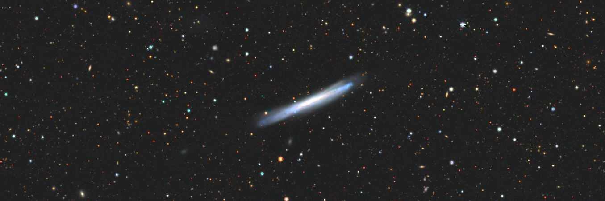
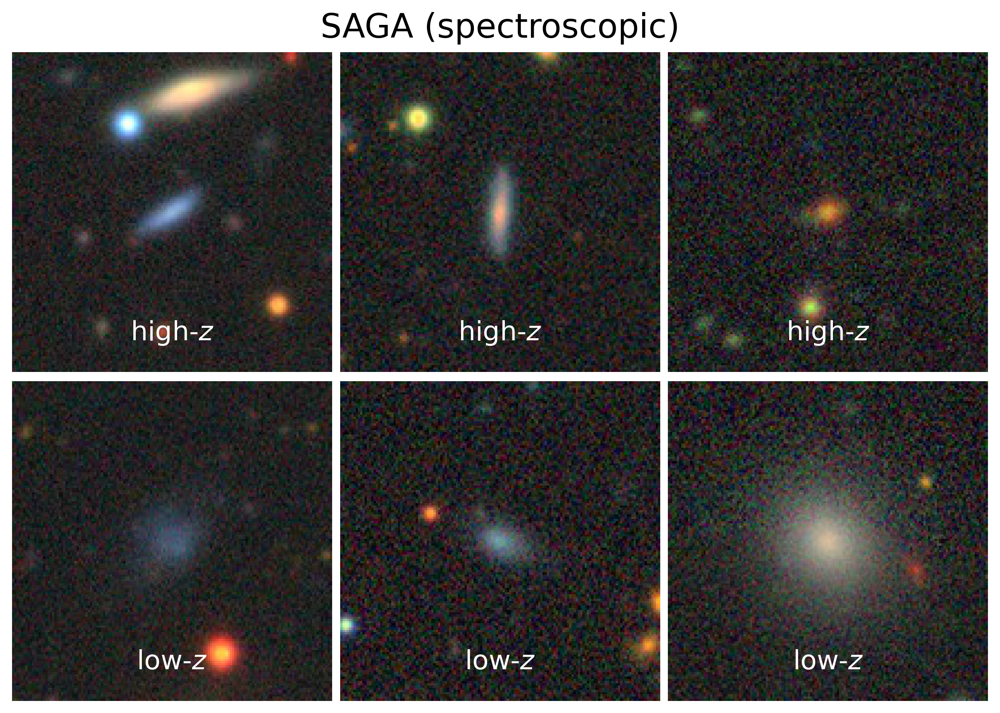

# xSAGA
Extending the SAGA Survey using deep learning

  

## Method: Identifying low-redshift galaxies with CNNs

We train a convolutional neural network (CNN) to distinguish low-*z* galaxies from the more numerous high-*z* objects. Each galaxy is given a CNN prediction (*p*CNN) betwen 0 and 1 that encodes how likely its redshift is *z* < 0.03. 

  
   

## Data

We feed image cutouts [DESI Legacy Imaging Surveys](https://www.legacysurvey.org/) as inputs to our CNN. Using the Legacy Survey RESTful API, we download *grz* (three-channel), 224×224 pixel images in `JPG` format. Example download scripts can be found in the `src/` directory.

Redshifts from the [Satellites Around Galactic Analogs (SAGA) Survey](https://ui.adsabs.harvard.edu/abs/2021ApJ...907...85M/abstract) comprise the training set labels. While the SAGA Stage II redshifts are publicly available [online](https://sagasurvey.org/), we use a proprietary redshift catalog of >100,000 objects that will be released in a future SAGA paper. 

After training the CNN, we make predictions for a test data set of 4.4 million photometrically selected candidates in SDSS/Legacy Survey (see paper for details).

## Results

### Satellite abundances

### Radial distributions of satellites

### Magnitude gap

### Comparison with the SAGA Survey

Our findings are completely consistent with the SAGA Paper II results for reasonably isolated host galaxies in the same stellar mass range (1010–1011 M⊙).

### Figures

All figures presented in our paper can be reproduced by running the cells in the `paper-figures.ipynb` Jupyter notebook. The notebook can be accessed through the [nbviewer website](https://nbviewer.org/github/jwuphysics/xSAGA/blob/main/paper-figures.ipynb).

# Code

# Citation

