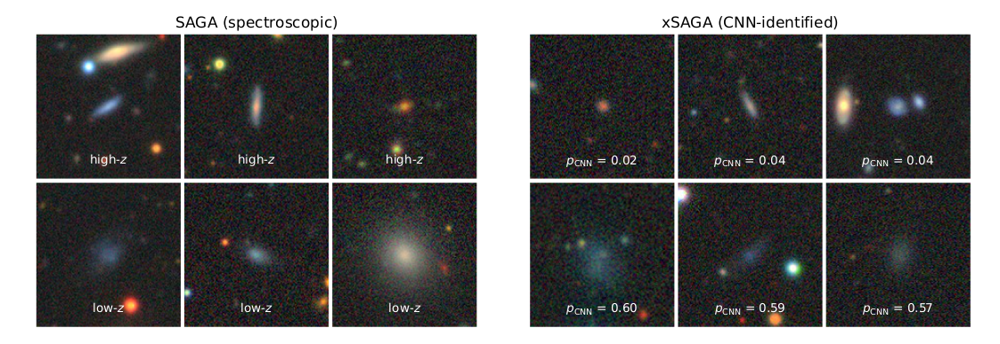
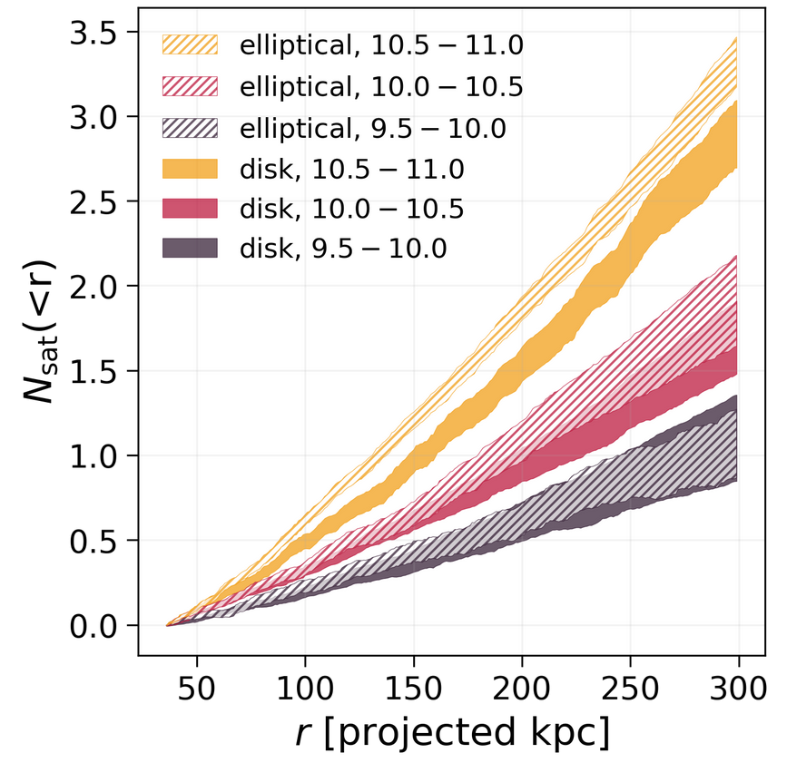
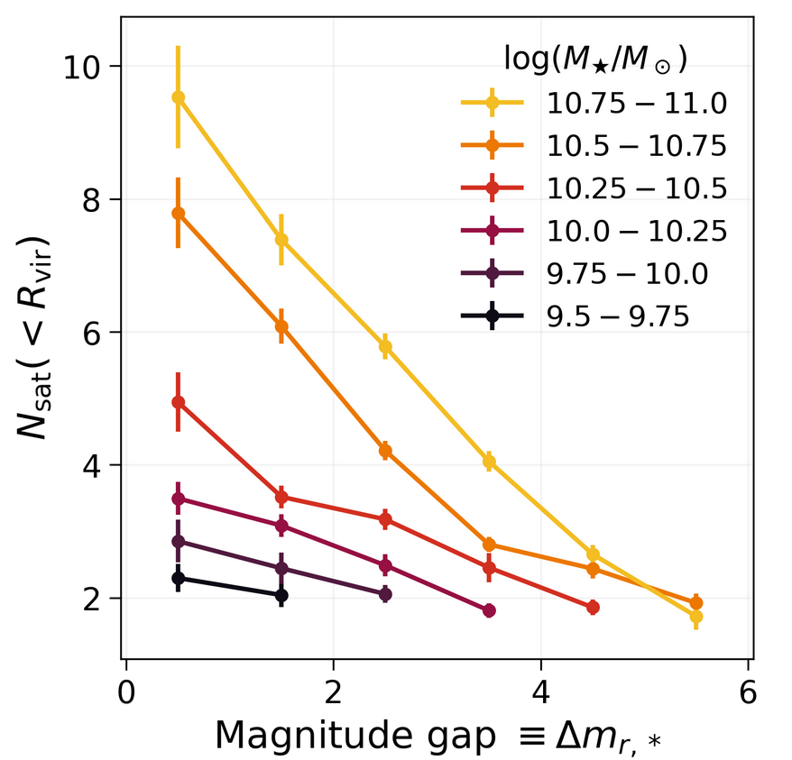
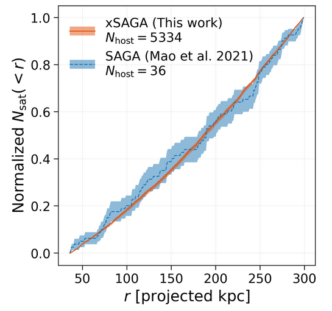

# xSAGA: Extending the SAGA Survey

## Identifying low-redshift galaxies with CNNs

We train a convolutional neural network (CNN) to distinguish low-redshift (*z* < 0.03) galaxies from the more numerous high-redshift objects. Each galaxy is given a CNN prediction (*p*<sub>CNN</sub>) betwen 0 and 1 that encodes how likely its redshift is *z* < 0.03. 

<p float="center">
  
</p>

## Results


### More massive host galaxies have more satellites.
We see that host galaxies with higher stellar masses also tend to have more satellites (see left panel of figure below). This is in line with expectations, but it is exciting to see such a strong signal!

  

### The radial distributions of satellites do not vary with host properties.
In the right panel above, we see that the normalized radial distributions of CNN-selected satellites are surprisingly insensitive to their host galaxies' stellar masses. The shapes of the radial profiles also do not appear to vary with the host's morphology or the magnitude gap between the brightest satellite and host galaxy.

### Satellites are most abundant around massive ellipticals.
In addition to the stellar mass dependence, we also find a modest increase in satellite richness around elliptical hosts (hatched shading in figure below) compared to around disky hosts (solid shading). The impact of morphology is stronger for more massive host galaxies.

  

### The satellite abundance correlates strongly with the magnitude gap between a host and its brightest satellite. 
In the figure below, we now compute the total number of satellites within the projected virial radius, and plot it against the magnitude gap and host stellar mass.

  

### xSAGA confirms and extends key SAGA Survey results. 
We compare the radial profiles of satellites around isolated host galaxies in the same stellar mass range as SAGA (10<sup>10</sup>–10<sup>11</sup> M<sub>⊙</sub>; see figure below). Our results are in excellent agreement.

  


## Data

We feed image cutouts [DESI Legacy Imaging Surveys](https://www.legacysurvey.org/) as inputs to our CNN. Using the Legacy Survey RESTful API, we download *grz* (three-channel), 224×224 pixel images in `JPG` format. Example download scripts can be found in the `src/` directory.

Redshifts from the [Satellites Around Galactic Analogs (SAGA) Survey](https://ui.adsabs.harvard.edu/abs/2021ApJ...907...85M/abstract) comprise the training set labels. While the SAGA Stage II redshifts are publicly available [online](https://sagasurvey.org/), we use a larger redshift catalog that will be released in a future SAGA paper. 

After we have trained the CNN, we can make predictions for a data set of 4.4 million photometrically selected candidates in SDSS/Legacy Survey (see paper for details). The CNN identifies over 100,000 objects as *probable* low-redshift galaxies, which vastly exceeds the number of *spectroscopically* confirmed low-redshift galaxies in existing surveys (e.g., SDSS, GAMA, or SAGA).

We define CNN-selected galaxies as satellite galaxies if they are within 300 projected kpc from a spectroscopically confirmed *z* < 0.03 host galaxy (from [NASA-Sloan Atlas](https://www.sdss.org/dr16/manga/manga-target-selection/nsa/) version `1_0_1`). We compute the number of satellites around each host galaxy as a function of projected radius, while correcting for incompleteness, false positives, and non-satellite galaxy contamination (each of which is independently determined via cross-validation).

## Figures and Code

All figures presented in our paper can be reproduced by running the cells in the `paper-figures.ipynb` Jupyter notebook. The notebook can be accessed through the [nbviewer website](https://nbviewer.org/github/jwuphysics/xSAGA/blob/main/paper-figures.ipynb). Note that the requirements in `requirements_at_publication.txt` must be used; otherwise there is a chance that the dependencies won't match. 

The code used for this analysis can be found in `xsaga/`. Most of the relevant methods are located in `satellites.py` and `radial_profiles.py`.

All steps for training the CNN (using `Pytorch` and `Fastai` version 2) are in `xsaga/cnn_train.py`. Note that this relies on the [`deconvolution`](https://github.com/yechengxi/deconvolution) module and the [hybrid deconvolution](https://github.com/jwuphysics/predicting-spectra-from-images/) code, which are copied into the `src/model/` directory.

Additional helper scripts are located in `src/`.


# Citation

The paper is titled: "Extending the SAGA Survey (xSAGA) I: Satellite Radial Profiles as a Function of Host Galaxy Properties."

The authors are: **John F. Wu (STScI)**, J. E. G. Peek (STScI/JHU), Erik J. Tollerud (STScI), Yao-Yuan Mao (Rutgers), Ethan O. Nadler (Carnegie/USC), Marla Geha (Yale), Risa H. Wechsler (Stanford/KIPAC/SLAC), Nitya Kallivayalil (U. Virginia), Benjamin J. Weiner (Steward/Arizona)

```
@ARTICLE{xSAGA2021,
    author = {{Wu}, J.~F. and {Peek}, J.~E.~G. 
        and {Tollerud}, E.~J. and {Mao}, Y.-Y. 
        and {Nadler}, E.~O. and {Geha}, M. 
        and {Wechsler}, R.~H. and {Kallivayalil}, N. 
        and {Weiner}, B.~J.},
    title = {Extending the SAGA Survey (xSAGA) I: 
        Satellite Radial Profiles as a Function of 
        Host Galaxy Properties},
    year = {2021},    
    journal = {ApJ, submitted}
}
```
